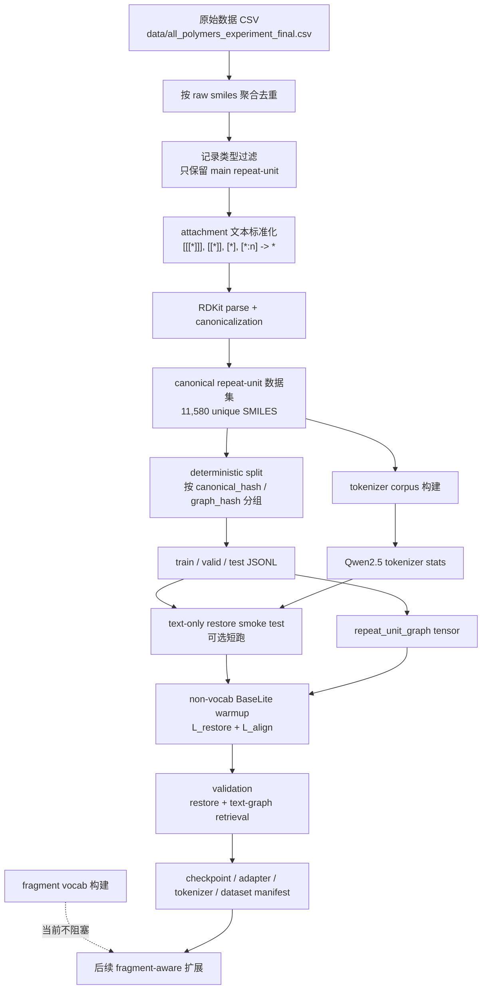
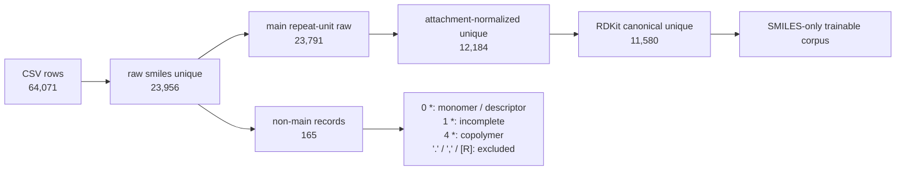
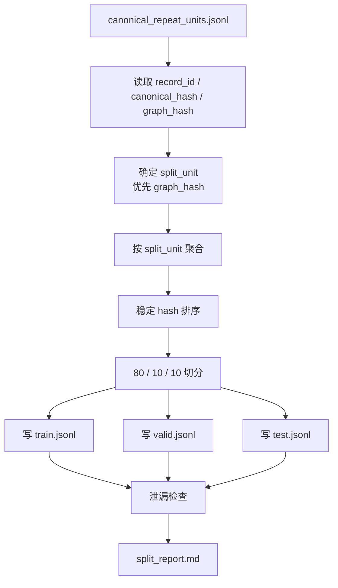
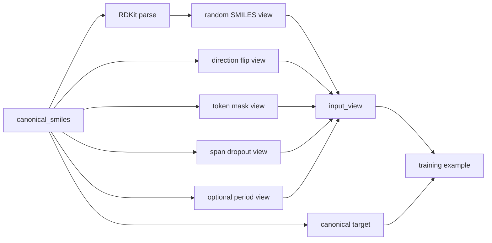
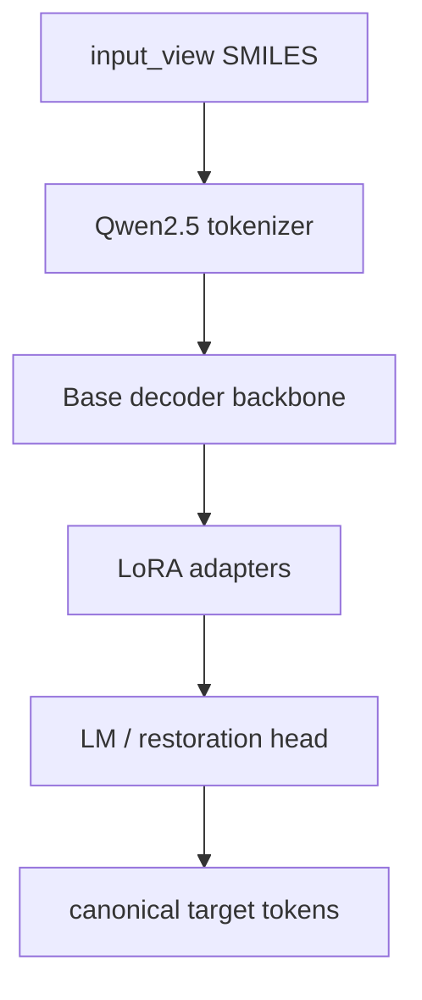
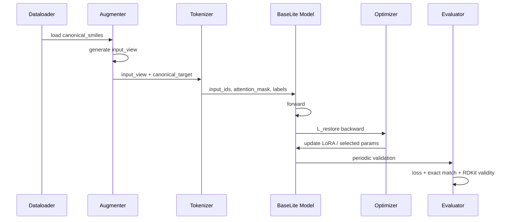
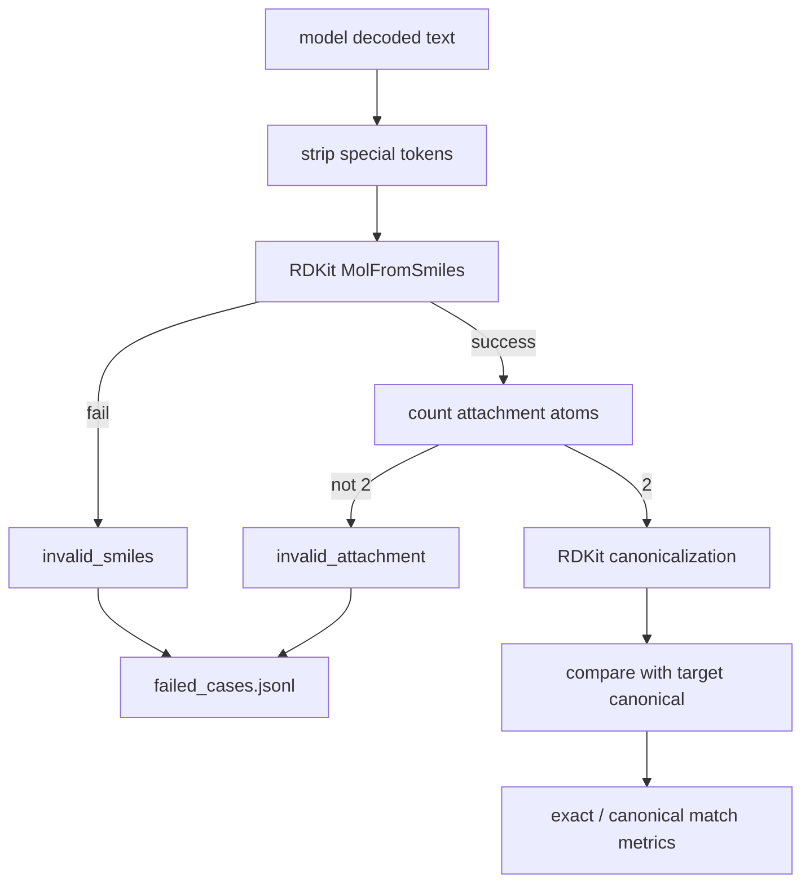
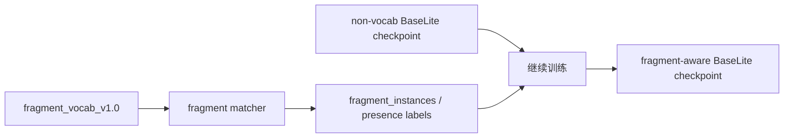
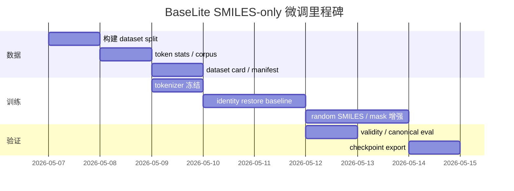

# BaseLite SMILES-only 微调完整流程报告

生成日期：2026-05-07
适用范围：BaseLite 早期 SMILES-only smoke test / baseline 数据与训练流程
不适用范围：性质预测、fragment vocab 匹配、fragment presence 标签、property attribution

状态注记：本文是早期 SMILES-only 数据与训练准备报告。当前 BaseLite warmup 已选择 Qwen2.5-7B Base，并包含 text-graph alignment、fragment presence 和 fragment consistency 等任务；tokenizer 与模板细节以 `docs/baselite_qwen25_warmup_template_design.md` 为准。

当前执行顺序应调整为：先做 text-only restore smoke test 打通工程流程；随后做不依赖 fragment 词表的 `L_restore + L_align` 作为正式第一阶段；fragment 词表稳定后再加入 fragment presence / consistency。

---

## 1. 结论

当前 SMILES-only 流程只作为 **restore smoke test / baseline** 推进。它可以验证 tokenizer、LoRA、restore head、decode/eval 和 checkpoint 保存加载，但不是正式 BaseLite warmup 第一阶段。

正式第一阶段应使用不依赖 fragment 词表的 `L_restore + L_align`：

```text
canonical repeat-unit SMILES + repeat_unit_graph
-> Qwen2.5 text branch + graph encoder
-> fusion / interaction layer
-> restore head + text-graph contrastive alignment
```

该阶段仍不依赖性质标签，也不依赖 fragment 词表匹配结果。

当前项目已经具备的基础数据：

| 数据层级 | 数量 | 说明 |
|---|---:|---|
| 原始 CSV 行数 | 64,071 | long-format 表，但当前只使用 `smiles` |
| raw unique polymer strings | 23,956 | 按原始 `smiles` 去重 |
| main repeat-unit raw candidates | 23,791 | 恰好两个 attachment point，排除多组分、共聚物、R 基等 |
| attachment-normalized main unique | 12,184 | 统一 `[[[*]]]`、`[[*]]`、`[*]`、`[*:n]` 为 `*` |
| RDKit canonical repeat-unit unique | 11,580 | 当前 BaseLite 主训练样本 |
| graph hash unique | 11,439 | 当前粗略 graph hash，只用于 split 防泄漏参考 |
| period-2 unique candidates | 55,060 | 可作为 cut-shift / period-view 候选增强，不作为强标准答案 |

因此当前执行顺序应是：

```text
canonical repeat-unit SMILES
-> deterministic split
-> tokenizer / token stats
-> text-only restore smoke test
-> repeat_unit_graph tensor
-> non-vocab BaseLite warmup: L_restore + L_align
-> checkpoint / adapter export
-> fragment_vocab 稳定后再做 fragment-aware warmup
```

---

## 2. 总体流程图



---

## 3. 当前阶段边界

### 3.1 训练需要什么

当前 BaseLite SMILES-only 微调只需要：

```text
record_id
canonical_smiles
canonical_hash
graph_hash
```

最小样本示例：

```json
{
  "record_id": "ru_000001",
  "canonical_smiles": "*#C[SiH2]C#Cc1cccc(C#*)c1",
  "canonical_hash": "536220867849e865a42471e588007f35b8dc4b65b970afd69b17f69f0cd1d882",
  "graph_hash": "3f698663995fb5f229e43a2545b46e9956f84fa699d4d1c001e11d3c46903886"
}
```

### 3.2 Smoke test 不需要什么

以下内容不进入 text-only restore smoke test：

| 内容 | 当前处理方式 |
|---|---|
| 性质名、性质值、单位 | 不参与训练，不参与 split，不参与 loss |
| fragment_instances | 等词表和 matcher 稳定后再接入 |
| fragment_presence_multi_hot_labels | 当前不生成、不训练 |
| property prediction head | 后续 Prop-first 阶段再做 |
| 多 repeat-unit 共聚物样本 | 当前排除，后续单独建模 |

---

## 4. 数据构建流程

### 4.1 数据链路



### 4.2 清洗标准

主训练样本必须满足：

1. 原始记录能提取非空 `smiles`。
2. 连接点标准化后恰好包含两个 `*`。
3. 不包含 `.`，避免盐、离子对、多组分形式进入主线。
4. 不包含 `,`，避免多个 repeat-unit 拼接进入主线。
5. 不包含 `[R]`、`[R1]`、`[R2]` 等未定义 R 基。
6. RDKit `MolFromSmiles` 能解析。
7. RDKit canonicalization 后唯一。

attachment 统一规则：

```text
[[[*]]] -> *
[[*]]   -> *
[*]     -> *
[*:1]   -> *
[*:2]   -> *
[*:n]   -> *
```

注意：`[R]` / `[R1]` / `[R2]` 不是 attachment token，不替换为 `*`。

### 4.3 输出文件建议

当前已有：

```text
data/processed/unique_standardized_smiles.csv
data/processed/canonical_repeat_units.jsonl
data/processed/repeat_unit_graphs.jsonl
data/processed/periods2_from_unique_standardized_smiles.csv
```

建议新增 SMILES-only 训练包：

```text
data/baselite_smiles_v1/
    dataset_manifest.json
    train.jsonl
    valid.jsonl
    test.jsonl
    tokenizer_corpus.txt
    token_stats.json
    split_report.md
    dataset_card.md
```

---

## 5. Split 设计

### 5.1 原则

split 的核心目标是避免同一个结构对象以不同文本写法泄漏到不同集合。

推荐优先级：

```text
graph_hash 分组
-> canonical_hash 分组
-> record_id 稳定排序
```

当前 `graph_hash` 是单 repeat-unit graph signature hash，用于比随机按行 split 更稳地降低结构泄漏风险。当前 BaseLite 训练 split 只覆盖 11,580 条 canonical repeat-unit SMILES；period-2 candidates 不作为训练样本，也不作为 split unit。

### 5.2 推荐比例

```text
train: 80%
valid: 10%
test: 10%
```

执行规则：

1. 按 split unit 聚合样本。
2. 对 split unit 做稳定 hash。
3. 按 hash 排序或 hash bucket 切分。
4. 同一个 split unit 的所有样本必须进入同一个 split。
5. period candidates 如果用于增强，必须继承 source canonical sample 的 split。

### 5.3 Split 流程图



### 5.4 必须检查

```text
intersection(train.graph_hash, valid.graph_hash) == empty
intersection(train.graph_hash, test.graph_hash) == empty
intersection(valid.graph_hash, test.graph_hash) == empty
intersection(train.canonical_hash, valid.canonical_hash) == empty
intersection(train.canonical_hash, test.canonical_hash) == empty
intersection(valid.canonical_hash, test.canonical_hash) == empty
```

---

## 6. Tokenizer 与文本格式

### 6.1 Tokenizer 目标

当前已选择 Qwen2.5-7B Base 作为基座模型，因此第一阶段使用 Qwen2.5 原生 tokenizer，而不是重新训练化学 tokenizer。已有 `token_stats.json` 用于验证该 tokenizer 对 11,580 条 canonical SMILES 的长度分布和 round-trip 可用性。

需要覆盖：

```text
bracket atom: [SiH2], [nH], [O-], [*:1]
atom: B, C, N, O, P, S, F, Cl, Br, I, Si
aromatic atom: b, c, n, o, p, s
bond: -, =, #, :, /, \
branch: (, )
ring index: 1, 2, ..., %10
attachment: *
plain text template tags
```

### 6.2 Special tokens 策略

```text
不新增 special tokens
不 resize embedding
不使用 Qwen chat template
EOS 使用 Qwen tokenizer 原生 <|endoftext|>
```

### 6.3 训练文本模板

当前 Qwen warmup 不采用“prompt 与 target 拼接成单序列”的模板。decoder trunk 只接收 view 输入；canonical target 单独 tokenize 成 `restore_labels`，用于监督 restore head。

```text
输入：
<polymer_view_smiles>
{input_view}
</polymer_view_smiles>

监督目标：
{canonical_smiles}<|endoftext|>
```

损失位置：

```text
restore_labels 只用于 L_restore
restore_labels 不进入 decoder trunk
restore_labels 不进入 L_align
```

这样模型学习的是：

```text
受扰动 SMILES / 等价 SMILES -> canonical SMILES
```

---

## 7. SMILES-only 增强策略

当前不使用 fragment matching，因此增强只允许依赖字符串和 RDKit。

| 增强 | 是否推荐 | 说明 |
|---|---:|---|
| token mask | 推荐 | 随机 mask 少量 token，目标恢复 canonical |
| span dropout | 推荐 | 删除短 span，比例要低，避免破坏全部结构信息 |
| atom-level random SMILES | 推荐 | RDKit random SMILES 作为等价视图 |
| direction flip | 推荐 | 两连接点方向翻转，目标仍为 canonical |
| period candidate view | 暂不启用 | `periods2` 只用于词表构建扩充；当前 BaseLite 主训练仍使用原始 11,580 条 canonical SMILES |
| fragment masking | 暂不推荐 | 依赖 fragment vocab，当前不进入主线 |

增强流程：



增强约束：

1. 每个增强样本必须保留原始 `record_id` 和 `canonical_hash`。
2. 增强样本不得改变 split。
3. 如果增强后 RDKit 无法解析，可作为 denoising 输入，但必须控制比例。
4. validation / test 默认只使用固定增强或无增强，避免评估噪声。

---

## 8. 训练样本 Schema

推荐 `train.jsonl` / `valid.jsonl` / `test.jsonl` 每行保留稳定元数据：

```json
{
  "record_id": "ru_000001",
  "canonical_smiles": "*#C[SiH2]C#Cc1cccc(C#*)c1",
  "canonical_hash": "536220867849e865a42471e588007f35b8dc4b65b970afd69b17f69f0cd1d882",
  "graph_hash": "3f698663995fb5f229e43a2545b46e9956f84fa699d4d1c001e11d3c46903886",
  "split": "train"
}
```

dataloader 在线生成：

```json
{
  "input_text_view1": "<polymer_view_smiles>\n*#C[SiH2]C#Cc1cccc(C#*)c1\n</polymer_view_smiles>\n",
  "target_text": "*#C[SiH2]C#Cc1cccc(C#*)c1<|endoftext|>",
  "restore_labels": "token ids of target_text",
  "augmentation": "identity"
}
```

不建议把所有增强结果提前完全展开成主数据集。更稳的方式是：

```text
基础 JSONL 固定
dataloader 按 epoch / seed 动态生成 view
```

这样数据版本更小，也能避免把增强样本误当成独立结构样本。

---

## 9. 模型微调流程

### 9.1 模型结构

text-only restore smoke test 只需要文本分支：



参数策略：

| 模块 | 当前建议 |
|---|---|
| tokenizer | 训练前冻结 |
| decoder backbone | 冻结或低学习率解冻最后若干层 |
| LoRA | 训练 |
| LM / restore head | 不因新增 token 调整；当前不新增 token，restore head 按任务需要训练 |
| graph encoder | 当前不需要 |
| fragment head | 当前不需要 |

### 9.2 训练目标

主 loss：

```text
L_restore = CE(predicted_target_tokens, canonical_smiles_tokens)
```

可选辅助 loss：

```text
L_lm = CE(next_token_prediction on canonical_smiles)
L_view_consistency = contrastive / cosine consistency between two text views
```

当前第一版建议：

```text
L_total = L_restore
```

等基础训练稳定后再加入 view consistency。

### 9.3 训练循环



### 9.4 推荐训练配置

```yaml
train:
  task: smiles_restore
  precision: bf16
  max_epochs: 10-20
  global_batch_size: 128
  gradient_accumulation_steps: 4
  max_seq_len: based_on_p99_length
  eval_every_steps: 500
  save_every_steps: 1000

optimizer:
  type: AdamW
  weight_decay: 0.01
  max_grad_norm: 1.0

learning_rate:
  lora: 1.0e-4
  lm_head: 5.0e-5
  embeddings: 5.0e-5

scheduler:
  type: cosine
  warmup_ratio: 0.03
```

`max_seq_len` 不应拍脑袋固定，应由 token 统计决定。建议以 train set token length 的 p99 或 p99.5 为主，超长样本单独报告。

---

## 10. 验证指标

### 10.1 训练过程指标

```text
train_loss
valid_loss
token_accuracy
exact_string_match
canonical_match
RDKit_validity
two_attachment_validity
unknown_token_ratio
truncation_ratio
```

### 10.2 结构合法性指标

模型输出需要做后处理和验证：

1. 去掉模板标签与 tokenizer EOS。
2. RDKit parse。
3. 检查是否恰好两个 `*`。
4. canonicalize 输出。
5. 与 target canonical SMILES 比较。

指标定义：

| 指标 | 定义 |
|---|---|
| exact_string_match | 解码字符串与 target 完全一致 |
| RDKit_validity | 解码字符串能被 RDKit 解析 |
| two_attachment_validity | 解码字符串恰好两个 attachment |
| canonical_match | 解码后 canonical SMILES 与 target canonical 相同 |
| invalid_rate_by_length | 按长度 bucket 统计非法率 |

### 10.3 验证流程图



### 10.4 验收阈值建议

第一版可接受阈值：

```text
RDKit_validity >= 0.95
two_attachment_validity >= 0.95
canonical_match >= 0.80
unknown_token_ratio == 0
split_leakage_count == 0
```

更严格版本：

```text
RDKit_validity >= 0.98
two_attachment_validity >= 0.98
canonical_match >= 0.90
```

---

## 11. Checkpoint 与发布物

一次可复现的 BaseLite SMILES-only 微调至少应导出：

```text
outputs/baselite_smiles_v1/
    adapter_model.safetensors
    adapter_config.json
    tokenizer.json
    tokenizer_config.json
    special_tokens_map.json
    training_config.yaml
    dataset_manifest.json
    eval_report.md
    eval_metrics.json
    failed_cases.jsonl
```

如果训练的是完整模型权重，则替换为：

```text
model.safetensors
config.json
```

`dataset_manifest.json` 必须记录：

```json
{
  "source_csv_sha256": "...",
  "canonical_repeat_units_sha256": "...",
  "train_count": 9264,
  "valid_count": 1158,
  "test_count": 1158,
  "split_unit": "graph_hash",
  "tokenizer_version": "baselite_smiles_tokenizer_v1",
  "augmentation_policy": "smiles_restore_v1"
}
```

实际 count 应由 split 脚本生成，不能手填。

---

## 12. 与 fragment vocab 的关系

当前正式第一阶段不等待 fragment vocab。先用 `L_restore + L_align` 打通 non-vocab BaseLite warmup；fragment vocab 完成后，再作为 fragment-aware 阶段接入。



接入 fragment 后新增内容：

```text
repeat_unit_graph
fragment_instances
fragment_presence_labels
fragment presence head
fragment consistency loss
```

但这些都不是当前 SMILES-only 训练的前置条件。

---

## 13. 可立即并行执行的任务清单

### P0: SMILES-only dataset package

产物：

```text
data/baselite_smiles_v1/train.jsonl
data/baselite_smiles_v1/valid.jsonl
data/baselite_smiles_v1/test.jsonl
data/baselite_smiles_v1/split_report.md
data/baselite_smiles_v1/dataset_card.md
```

验收：

```text
canonical_hash leakage = 0
graph_hash leakage = 0
record count 与 canonical_repeat_units.jsonl 一致
```

### P1: tokenizer corpus + token stats

产物：

```text
data/baselite_smiles_v1/tokenizer_corpus.txt
data/baselite_smiles_v1/token_stats.json
```

验收：

```text
unknown token = 0
length p50 / p90 / p95 / p99 明确
最长样本可追溯 record_id
```

### P2: SMILES view augmenter

产物：

```text
scripts/build_baselite_smiles_dataset.py
scripts/check_baselite_smiles_dataset.py
```

验收：

```text
identity view 可复现
mask / dropout 比例可配置
random SMILES 失败样本可记录
valid/test 增强策略固定
```

### P3: training config skeleton

产物：

```text
configs/baselite_smiles_restore_v1.yaml
```

验收：

```text
明确 tokenizer path
明确 train/valid/test path
明确 max_seq_len 来源
明确 loss mask 策略
```

---

## 14. 风险与处理

| 风险 | 影响 | 处理 |
|---|---|---|
| `graph_hash` 不是严格 graph isomorphism hash | split 防泄漏不完美 | 当前作为强于随机 split 的临时方案；如后续 canonical graph 逻辑变更，需要重新生成 split 并复核泄漏 |
| period candidates 不是当前训练样本 | 误用会改变训练分布 | 当前默认不启用，period2 仅用于词表构建扩充 |
| 过强 mask / dropout | 输入信息不足，训练变成猜测 | 第一版 mask 比例保守，先跑 identity + random SMILES |
| tokenizer 粒度不合适 | OOV 或序列过长 | 先输出 token stats，再冻结 vocab |
| validation 使用随机增强 | 指标不稳定 | valid/test 使用 identity 或固定 seed 增强 |
| attachment 输出非法 | 模型学到普通 SMILES 但不是 polymer RU | attachment validity 作为硬指标 |

---

## 15. 推荐里程碑



---

## 16. 最终交付定义

当前阶段完成的标准不是“训练 loss 能下降”，而是下面这些条件同时满足：

1. 数据集 split 可复现，且无 canonical / graph hash 泄漏。
2. tokenizer 固定，`unknown_token_ratio == 0`。
3. dataloader 能稳定生成 `input_view -> canonical_target`，并能加载 `repeat_unit_graph`。
4. 模型能在 valid/test 上输出合法 polymer repeat-unit SMILES。
5. RDKit validity、two-attachment validity、canonical match 均有报告。
6. checkpoint、tokenizer、训练配置、数据 manifest、评估报告一起归档。
7. fragment vocab 完成后，可以在该 checkpoint 基础上继续做 fragment-aware 扩展，而不需要重做 non-vocab warmup。

一句话版本：

```text
BaseLite 当前微调主线 = 只用 canonical repeat-unit SMILES 做自监督恢复训练；
性质标签和 fragment 匹配都不是前置依赖。
```
