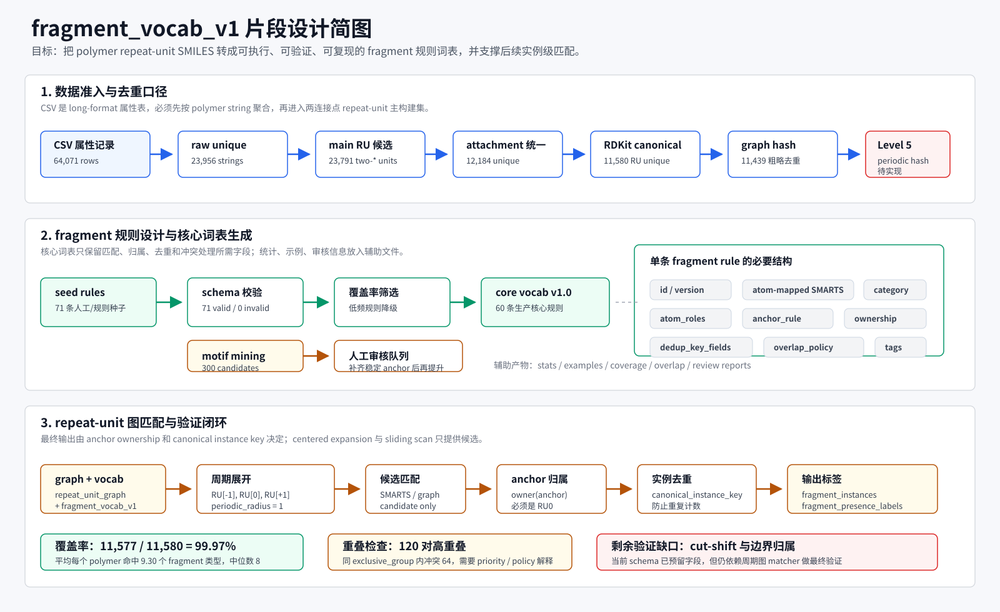

# fragment_vocab_v1 片段设计说明图

本说明图基于当前 `scripts/build_fragment_vocab_v1.py`、`fragments/fragment_vocab_v1.0.build_summary.json`、`fragments/vocab/fragment_vocab_v1.0.jsonl` 和验证报告整理，用于快速说明片段词表从数据准入、规则设计到图匹配验证的主线。

## 读图要点

1. 数据侧先从 long-format 属性表聚合到 unique polymer string，再经过 attachment 统一、RDKit canonicalization 和粗略 graph hash 去重。
2. 词表项不是简单的 `fragment_name + SMARTS`，而是包含 atom-mapped SMARTS、`atom_roles`、`anchor_rule`、`ownership_rule`、`dedup_key_fields` 和 `overlap_policy` 的可执行规则。
3. `mined_motif_candidates.jsonl` 只作为人工审核候选；只有补齐稳定 anchor SMARTS 和匹配策略后，才应提升到核心词表。
4. 后续实例级匹配的核心判断是 `owner(anchor) == RU0` 加 `canonical_instance_key` 去重，centered periodic expansion 和 cut-shift scan 只产生候选。
5. 当前核心词表覆盖率很高，但 cut-shift 稳定性和边界归属准确率仍是待周期图 matcher 完成后的验证项。
