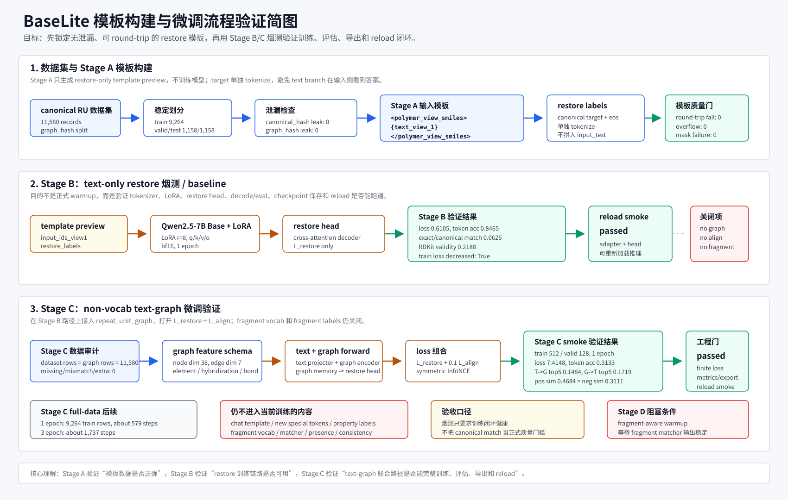

# BaseLite 模板构建与微调流程验证说明图

本说明图基于当前模板设计文档、Stage A 模板预览报告、Stage B restore smoke 结果、Stage C non-vocab 数据审计和 smoke eval 结果整理，用于快速说明模板构建和微调验证闭环。

## 读图要点

1. Stage A 只构建 restore-only template preview，不训练模型；`restore_labels` 单独 tokenization，不拼入 `input_text_view1`。
2. 模板阶段的主要验收是数据正确性：split 无泄漏、tokenizer round-trip 无失败、长度不溢出、mask 无错误。
3. Stage B 是 text-only restore 烟测，用于验证 Qwen2.5-7B Base LoRA、restore head、decode/eval、checkpoint 导出和 reload。
4. Stage C 在 Stage B 基础上接入 repeat-unit graph，打开 `L_restore + L_align`，但仍关闭 fragment vocab、fragment matcher、fragment presence 和 fragment consistency。
5. 当前 Stage C smoke 的验收口径是工程健康：loss 有限、指标可计算、产物完整、reload 通过；正式质量提升应看后续 full-data 1 epoch / 3 epoch 运行。
